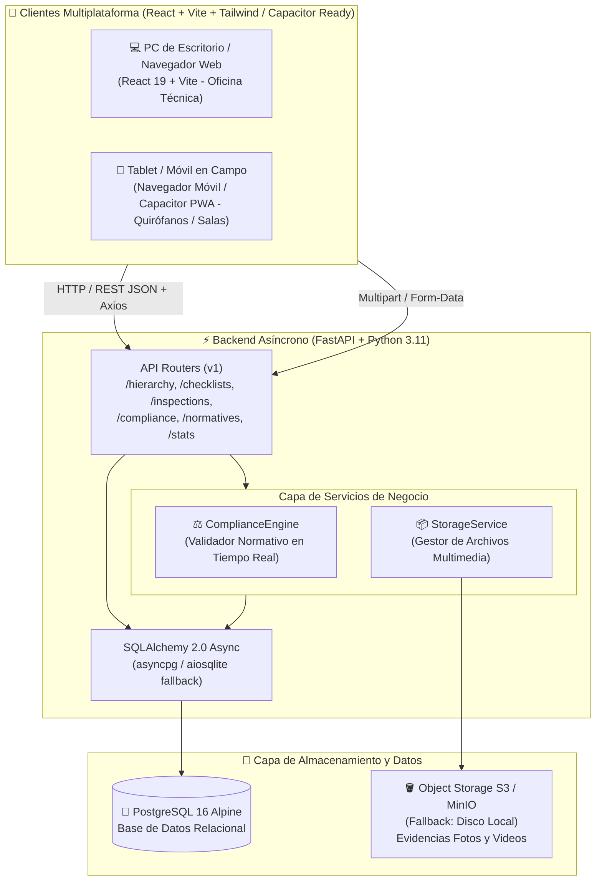
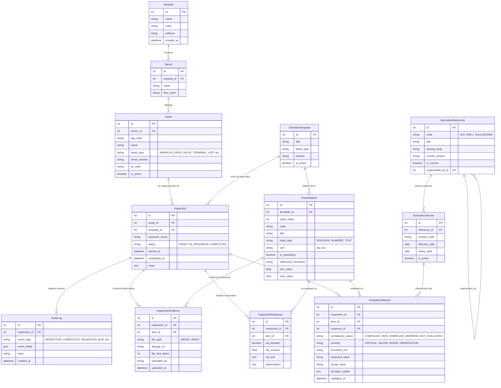
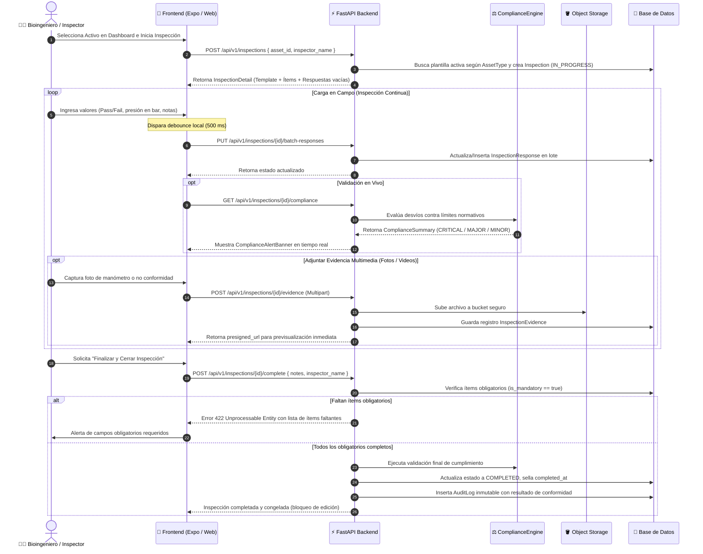

# 🏛️ ARQUITECTURA GENERAL Y BLUEPRINT DEL SISTEMA (GMAO GRUPO 19)

> **Documento Maestro de Arquitectura y Especificación Técnica (SSOT)**  
> *Diseñado como referencia integral para desarrolladores, bioingenieros y agentes de Inteligencia Artificial.*  
> *Última actualización técnica: Septiembre 2026.*

---

## 1. 📌 Resumen Ejecutivo y Dominio del Sistema

El proyecto es un **GMAO / CMMS (Gestión de Mantenimiento Asistido por Ordenador)** especializado en **Ingeniería Clínica y Bioingeniería Hospitalaria**, enfocado en la digitalización, verificación técnica, trazabilidad y auditoría de **redes de distribución de gases medicinales** (Oxígeno $O_2$, Aire Medicinal, Vacío y Óxido Nitroso $N_2O$).

### Marcos Normativos Implementados
1. **Resolución MSAL 1130/2000 (Ministerio de Salud de la Nación Argentina)**:
   - Requisitos para cilindros y envases a presión: prueba hidráulica obligatoria cada 5 años (IRAM 2529), rotulado legal con lote/vencimiento, leyenda *"Uso Exclusivo Medicinal"*, identificación visual obligatoria con **cruz griega verde**, código cromático estandarizado y precintos termocontraíbles.
2. **Norma ISO 7396-1:2016 (Sistemas de distribución de gases medicinales)**:
   - Seguridad en redes de tuberías para gases comprimidos y vacío.
   - Protocolos para centrales manifold conmutadas, válvulas de corte de área (AVSU), bocas terminales/tomas de consumo y estaciones reductoras de presión (1ra y 2da etapa).

---

## 2. 🗺️ Diagrama de Arquitectura de Sistemas

El sistema está concebido como un monorepo desacoplado con servicios contenerizados en Docker.

---

## 3. 🗄️ Modelo de Datos y Diagrama Entidad-Relación (ERD)

El modelo relacional garantiza integridad referencial estricta, claves foráneas en cascada y trazabilidad inmutable mediante bitácoras de auditoría.

---

## 4. 🔄 Flujo de Trabajo y Ciclo de Vida de una Inspección

---

## 5. 🔌 Catálogo Completo de Endpoints Backend

| Módulo | Método | Ruta | Entrada | Salida | Descripción |
| :--- | :--- | :--- | :--- | :--- | :--- |
| **Salud** | `GET` | `/health` | Ninguna | `{ status, env, debug }` | Monitoreo y liveness probe de la API. |
| **Jerarquía** | `GET` | `/api/v1/hierarchy` | Ninguna | `HierarchyTreeResponse` | Árbol completo (Hospitales $\rightarrow$ Sectores $\rightarrow$ Activos) y métricas. |
| **Checklists** | `GET` | `/api/v1/checklists/template?asset_type={type}` | Query Param | `ChecklistTemplateRead` | Plantilla activa por tipo de activo. |
| **Checklists** | `GET` | `/api/v1/checklists/templates` | Ninguna | `List[ChecklistTemplateRead]` | Listado de todas las plantillas registradas. |
| **Inspección** | `POST`| `/api/v1/inspections` | `InspectionCreate` | `InspectionDetailRead` | Inicia una sesión vinculada a un activo. |
| **Inspección** | `GET` | `/api/v1/inspections/{id}` | Path Param | `InspectionDetailRead` | Detalle con ítems, respuestas, evidencias y cumplimiento. |
| **Inspección** | `PUT` | `/api/v1/inspections/{id}/batch-responses` | `BatchInspectionResponsesRequest` | `InspectionDetailRead` | Guardado atómico con debounce de respuestas. |
| **Inspección** | `POST`| `/api/v1/inspections/{id}/complete` | `InspectionCompleteRequest` | `InspectionDetailRead` | Cierre, validación de obligatoriedad y congelamiento. |
| **Inspección** | `GET` | `/api/v1/inspections` | `status`, `asset_id`, `limit`, `offset` | `List[InspectionDetailRead]` | Listado con filtros paginados. |
| **Evidencia** | `POST`| `/api/v1/inspections/{id}/evidence` | Multipart (`file`, `item_id`, `uploaded_by`) | `InspectionEvidenceRead` | Carga de fotos/videos a S3/MinIO con URL prefirmada. |
| **Evidencia** | `DELETE`| `/api/v1/evidence/{evidence_id}` | Path Param | `{ message }` | Eliminación de archivo y registro de evidencia. |
| **Auditoría** | `GET` | `/api/v1/compliance/inspections/{id}/compliance` | Query `recalculate` | `ComplianceSummary` | Evaluación en vivo por el `ComplianceEngine`. |
| **Auditoría** | `GET` | `/api/v1/compliance/audit-logs` | `inspection_id`, `event_type` | `List[AuditLogRead]` | Bitácora inmutable append-only de eventos legales. |
| **Normativas** | `GET` | `/api/v1/normatives` | `is_current` | `List[NormativeReferenceRead]` | Catálogo maestro de normas y versiones vigentes. |
| **Normativas** | `GET` | `/api/v1/normatives/templates/{id}/currency-check` | Path Param | `NormativeCurrencyReport` | Verifica si una plantilla contiene normas desactualizadas. |
| **Historial** | `GET` | `/api/v1/assets/{id}/history` | Path Param | `List[InspectionHistoryItem]` | Línea de tiempo histórica de un activo. |
| **Estadísticas**| `GET` | `/api/v1/stats` | Ninguna | `StatsOverviewResponse` | KPIs para el Dashboard (conteos y % de cumplimiento). |

---

## 6. 🎨 Arquitectura del Frontend y Árbol de Componentes (`frontend/`)

### Estructura de Navegación (React Router v7 + React 19)
* **`src/components/layout/Layout.tsx`:** Layout responsivo base con `Header` sticky, `Sidebar` desktop + drawer móvil, y `<Outlet />`.
* **`src/App.tsx`:** Configuración declarativa de rutas:
  * `/` $\rightarrow$ Redirección a `/dashboard`
  * `/dashboard` $\rightarrow$ `DashboardPage.tsx`
  * `/inspections` $\rightarrow$ `HistoryPage.tsx` (Lista de inspecciones y auditorías activas)
  * `/history` $\rightarrow$ `HistoryPage.tsx` (Historial y trazabilidad por componente)
  * `/inspections/:id` $\rightarrow$ `InspectionPage.tsx`
* **`src/pages/DashboardPage.tsx`:**
  * Métricas KPI (conteos y % de cumplimiento).
  * Selector jerárquico multinivel (`HierarchySelector`).
  * Modal Radix Dialog para inicio rápido de inspección.
  * Listado de inspecciones recientes.
* **`src/pages/HistoryPage.tsx`:**
  * Historial global con búsqueda y filtros por estado (`ALL`, `COMPLETED`, `IN_PROGRESS`).
  * Vista dual: Listado de auditoría o Línea de Tiempo del Componente (`ComponentHistoryTimeline`).
* **`src/pages/InspectionPage.tsx`:**
  * Pantalla de ejecución de checklist clínico en campo.
  * Auto-guardado con debounce (700 ms) mediante `AutoSaveIndicator`.
  * Validación en tiempo real mediante el hook `useComplianceValidation`.
  * Integración de `MediaUploader` (cámara/galería web nativa) y `EvidenceThumbnail`.
  * Modal Radix Dialog para cierre y sellado final con validación estricta de obligatoriedad (HTTP 422).

### Biblioteca de Componentes (`frontend/src/components/`)
* **`checklist/`**:
  * `ChecklistCard.tsx`: Renderiza cada ítem según su tipo (`BOOLEAN`, `NUMERIC`, `TEXT`), mostrando límites de tolerancia, badge normativo y campo de observaciones.
  * `AutoSaveIndicator.tsx`: Badge animado de estado (*Guardando...*, *Guardado*, *Error*).
  * `NormativeBadge.tsx`: Etiqueta con el artículo normativo (ej: `ISO 7396-1:cl.5.3`).
  * `ComplianceBadge.tsx`: Indicador de estado de conformidad (`COMPLIANT`, `NON_COMPLIANT`, `WARNING`).
  * `ComplianceAlertBanner.tsx`: Alerta visual flotante ante desvíos críticos.
  * `ComplianceSummaryCard.tsx`: Resumen ejecutivo de la inspección (% de cumplimiento, desvíos críticos/mayores).
  * `MediaUploader.tsx`: Botón para captura o selección de fotos y videos con validación previa de tamaño.
  * `EvidenceThumbnail.tsx`: Miniatura con soporte para modal de imagen ampliada y reproducción de video.
* **`hierarchy/`**:
  * `HierarchySelector.tsx`: Menús desplegables interconectados Hospital $\rightarrow$ Sector $\rightarrow$ Activo.
* **`history/`**:
  * `ComponentHistoryTimeline.tsx`: Línea de tiempo vertical que compara inspecciones pasadas de un mismo activo.
* **`ui/`**:
  * Componentes atómicos de diseño: `Button`, `Card`, `Badge`, `Input`, `ProgressBar`.

---

## 7. 📖 Glosario de Términos del Dominio Clínico

* **GMAO / CMMS:** Gestión de Mantenimiento Asistido por Ordenador. Software para planificar, registrar y auditar el mantenimiento de equipamiento e instalaciones.
* **Manifold (Central de Baterías):** Sistema central de suministro que agrupa cilindros de alta presión con conmutación automática entre banco de servicio y banco de reserva.
* **AVSU (Area Valve Service Unit):** Válvula de corte de área. Permite aislar sectores específicos (ej: un quirófano) en emergencias o mantenimiento sin cortar el gas al resto del hospital.
* **Terminal Unit (Boca Terminal):** Conector rápido de pared o columna donde se enchufan los equipos médicos (respiradores, caudalímetros, aspiradores).
* **Regulador de Presión:** Válvula que reduce la alta presión de los cilindros o red central a presiones seguras de distribución (típicamente $4\text{ bar}$ a $5\text{ bar}$ en gases comprimidos; $-0.6\text{ bar}$ a $-0.8\text{ bar}$ en vacío).
* **Cruz Griega Verde:** Símbolo reglamentario obligatorio según Res. MSAL 1130/2000 que identifica envases aptos exclusivamente para uso medicinal.
* **Prueba Hidráulica (IRAM 2529):** Ensayo a presión para verificar la integridad estructural del cilindro. Validez máxima legal: 5 años.

---

## 8. 🛡️ Directrices y Reglas de Oro para Agentes de IA

Cualquier IA o desarrollador que modifique o extienda este repositorio **DEBE** respetar las siguientes directrices:

1. **Inmutabilidad de Inspecciones Cerradas:**
   * Una vez que `Inspection.status == InspectionStatus.COMPLETED`, **está estrictamente prohibido** alterar sus respuestas o adjuntar nuevas evidencias. El backend rechaza estas operaciones con error HTTP 400.
2. **Validación de Completitud Obligatoria:**
   * Antes de sellar una inspección (`/complete`), el backend **siempre** valida que todos los ítems con `is_mandatory = True` tengan un valor asignado. Si falta alguno, debe responderse `422 Unprocessable Entity`.
3. **Persistencia Asíncrona en Backend:**
   * Usar siempre la sintaxis de **SQLAlchemy 2.0 Async** (`await db.execute(select(...))`, `db.add(...)`, `await db.commit()`).
   * Nunca realizar operaciones sincrónicas bloqueantes de I/O en endpoints.
   * Usar `selectinload` o `joinedload` para relaciones para evitar el problema de $N+1$ queries o errores de lazy-loading en contexto asíncrono.
4. **Desacoplamiento de Almacenamiento:**
   * Los archivos multimedia nunca se guardan como blobs en PostgreSQL. Se gestionan mediante `storage_service` (`StorageService`), delegando a MinIO/S3 o almacenamiento local según la configuración.
5. **Tipado Estricto en Frontend:**
   * Cada nuevo endpoint o modelo de datos debe reflejarse simultáneamente en `frontend/services/types.ts` y en `frontend/services/api.ts`.
6. **Diseño Multiplataforma:**
   * Los componentes de UI deben ser compatibles tanto con navegadores de escritorio (Web) como con dispositivos táctiles (Mobile / Expo Go). Evitar APIs exclusivas de React DOM que rompan en React Native.
