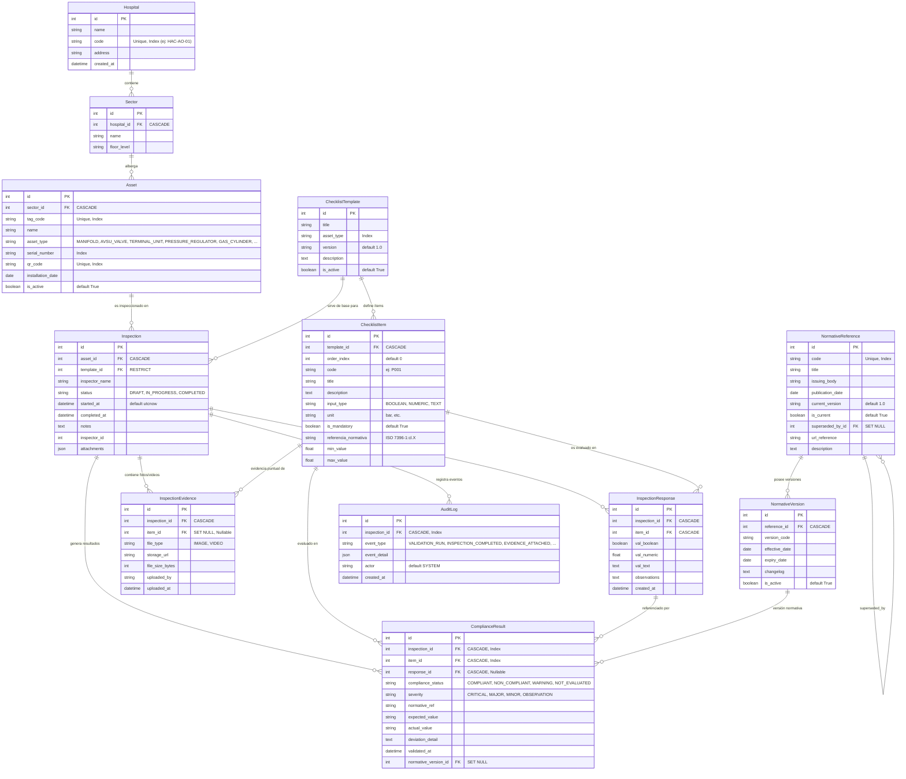
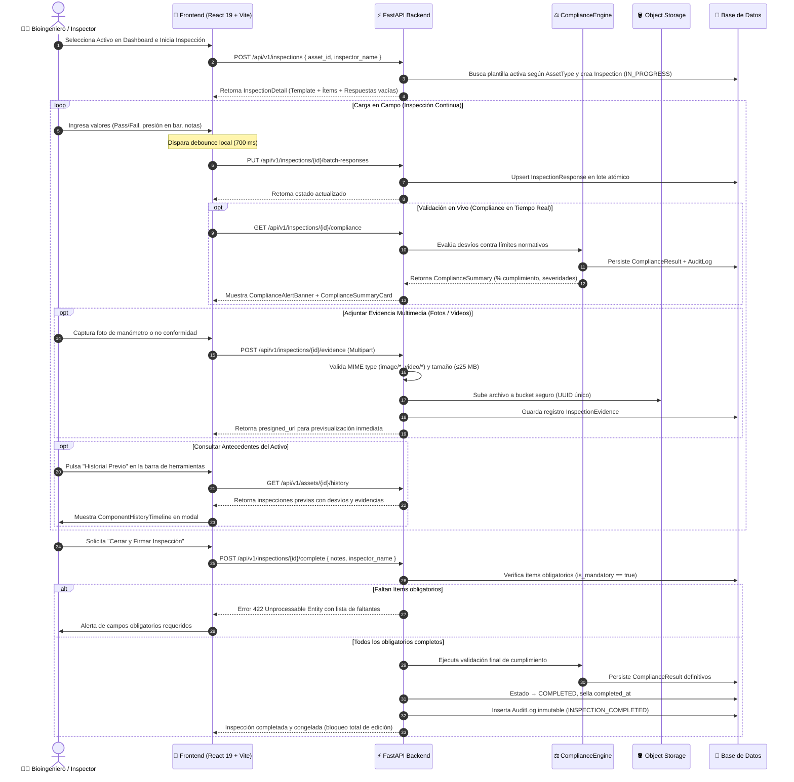
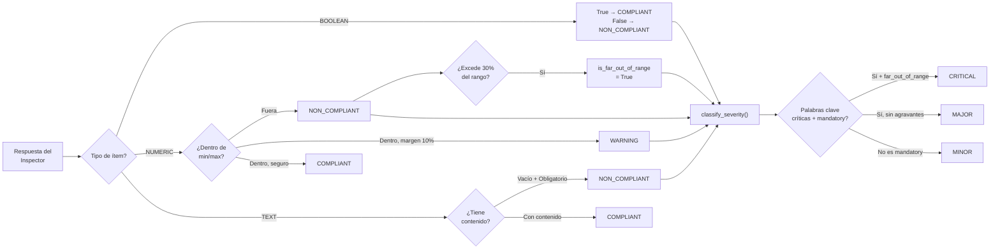

# 🏛️ ARQUITECTURA GENERAL Y BLUEPRINT DEL SISTEMA (GMAO GRUPO 19)

> **Documento Maestro de Arquitectura y Especificación Técnica (SSOT)**  
> *Diseñado como referencia integral para desarrolladores, bioingenieros y agentes de Inteligencia Artificial.*  
> *Última actualización técnica: 29 de Septiembre de 2026 — Objetivos 1, 2, 3 y 4 completados.*

---

## 1. 📌 Resumen Ejecutivo y Dominio del Sistema

El proyecto es un **GMAO / CMMS (Gestión de Mantenimiento Asistido por Ordenador)** especializado en **Ingeniería Clínica y Bioingeniería Hospitalaria**, enfocado en la digitalización, verificación técnica, trazabilidad y auditoría de **redes de distribución de gases medicinales** (Oxígeno $O_2$, Aire Medicinal, Vacío y Óxido Nitroso $N_2O$).

### Marcos Normativos Implementados
1. **Resolución MSAL 1130/2000 (Ministerio de Salud de la Nación Argentina)**:
   - Buenas Prácticas de Fabricación y Control de Gases Medicinales. Clasifica al gas medicinal como medicamento crítico.
   - Requisitos para cilindros y envases a presión: prueba hidráulica obligatoria cada 5 años (IRAM 2529), rotulado legal con lote/vencimiento/pureza, leyenda obligatoria, identificación visual con **cruz griega verde**, código cromático estandarizado (Res. 324/77) y precintos termocontraíbles.
   - Indexados **74 ítems de auditoría** catalogados por severidad STPA.
2. **Norma ISO 7396-1:2016 (Sistemas de distribución de gases medicinales)**:
   - Seguridad en redes de tuberías para gases comprimidos y vacío.
   - Protocolos para centrales manifold conmutadas, válvulas de corte de área (AVSU), bocas terminales, estaciones reductoras de presión y alarmas clínicas.
   - Indexados más de **150 parámetros** de auditoría.
3. **Norma IRAM 2529**: Ensayo de presión hidrostática para cilindros. Validez legal máxima: 5 años.

### Estado de Objetivos Específicos

| OE | Descripción | Estado |
|---|---|---|
| **1** | Checklists digitales dinámicos con trazabilidad normativa, soporte táctil y auto-guardado | ✅ Completado |
| **2** | Motor de cumplimiento normativo en tiempo real, catálogo de normas vigentes, alertas de severidad, bitácora inmutable | ✅ Completado |
| **3** | Historial centralizado por componente con evidencia multimedia (fotos/videos) | ✅ Completado |
| **4** | Motor de reportes con generación automática de informes estructurados | ✅ Completado |

---

## 2. 🗺️ Diagrama de Arquitectura de Sistemas

```mermaid
flowchart TB
    subgraph CLIENTES["📱 Clientes Multiplataforma (React 19 + Vite + Tailwind v4 / Capacitor Ready)"]
        WEB["💻 PC de Escritorio / Navegador Web\n(Oficina Técnica — Gestión y Auditoría)"]
        TABLET["📱 Tablet / Móvil en Campo\n(Quirófanos / Salas — Carga ágil con cámara nativa)"]
    end

    subgraph BACKEND["⚡ Backend Asíncrono (FastAPI + Python 3.11)"]
        ROUTERS["API Routers (v1)\n/hierarchy, /checklists, /inspections,\n/compliance, /normatives, /stats,\n/evidence, /audit-logs, /reports"]
        
        subgraph SERVICIOS["Capa de Servicios de Negocio"]
            COMP_ENG["⚖️ ComplianceEngine\n(Validador Normativo en Tiempo Real)\n• Evaluación booleana/numérica/texto\n• Banda de alerta preventiva (10%)\n• Clasificación CRITICAL/MAJOR/MINOR\n• Vigencia normativa (currency check)"]
            STORAGE_SVC["📦 StorageService\n(Gestor de Archivos Multimedia)\n• S3 / MinIO / Disco Local\n• Validación MIME (image/*, video/*)\n• Límite 25 MB\n• URLs prefirmadas"]
            REPORT_ENG["📄 ReportEngine\n(Motor de Informes Automáticos)\n• Acta de Inspección (PDF A4 / XLSX)\n• Historial cronológico por activo\n• Informe ejecutivo institucional\n• KPIs por sector, tipo y severidad"]
        end

        ORM["SQLAlchemy 2.0 Async\n(asyncpg / aiosqlite fallback)"]
    end

    subgraph PERSISTENCIA["💾 Capa de Almacenamiento y Datos"]
        DB[(🐘 PostgreSQL 16 Alpine\n13 tablas relacionales\n+ bitácora inmutable AuditLog)]
        OBJ_STORE["🪣 Object Storage S3 / MinIO\n(Fallback: Disco Local ./uploads/evidence)\nEvidencias: Fotos y Videos"]
    end

    CLIENTES -->|HTTP / REST JSON + Axios| ROUTERS
    CLIENTES -->|Multipart / Form-Data\n(fotos y videos)| ROUTERS
    ROUTERS --> SERVICIOS
    ROUTERS --> ORM
    SERVICIOS --> ORM
    ORM --> DB
    STORAGE_SVC --> OBJ_STORE
```

---

## 3. 🗄️ Modelo de Datos y Diagrama Entidad-Relación (ERD)

El modelo relacional garantiza integridad referencial estricta, claves foráneas en cascada y trazabilidad inmutable mediante bitácoras de auditoría.


```mermaid
erDiagram
    Hospital ||--o{ Sector : "contiene"
    Sector ||--o{ Asset : "alberga"
    
    Asset ||--o{ Inspection : "es inspeccionado en"
    ChecklistTemplate ||--o{ ChecklistItem : "define ítems"
    ChecklistTemplate ||--o{ Inspection : "sirve de base para"
    
    Inspection ||--o{ InspectionResponse : "registra respuestas"
    ChecklistItem ||--o{ InspectionResponse : "es evaluado en"
    
    Inspection ||--o{ InspectionEvidence : "contiene fotos/videos"
    ChecklistItem ||--o{ InspectionEvidence : "evidencia puntual de"
    
    NormativeReference ||--o{ NormativeVersion : "posee versiones"
    NormativeReference ||--o{ NormativeReference : "superseded_by"
    
    Inspection ||--o{ ComplianceResult : "genera resultados"
    ChecklistItem ||--o{ ComplianceResult : "evaluado en"
    InspectionResponse ||--o{ ComplianceResult : "referenciado por"
    NormativeVersion ||--o{ ComplianceResult : "versión normativa"
    
    Inspection ||--o{ AuditLog : "registra eventos"

    Hospital {
        int id PK
        string name
        string code "Unique, Index (ej: HAC-AO-01)"
        string address
        datetime created_at
    }

    Sector {
        int id PK
        int hospital_id FK "CASCADE"
        string name
        string floor_level
    }

    Asset {
        int id PK
        int sector_id FK "CASCADE"
        string tag_code "Unique, Index"
        string name
        string asset_type "MANIFOLD, AVSU_VALVE, TERMINAL_UNIT, PRESSURE_REGULATOR, GAS_CYLINDER, ..."
        string serial_number "Index"
        string qr_code "Unique, Index"
        date installation_date
        boolean is_active "default True"
    }

    ChecklistTemplate {
        int id PK
        string title
        string asset_type "Index"
        string version "default 1.0"
        text description
        boolean is_active "default True"
    }

    ChecklistItem {
        int id PK
        int template_id FK "CASCADE"
        int order_index "default 0"
        string code "ej: P001"
        string title
        text description
        string input_type "BOOLEAN, NUMERIC, TEXT"
        string unit "bar, etc."
        boolean is_mandatory "default True"
        string referencia_normativa "ISO 7396-1:cl.X"
        float min_value
        float max_value
    }

    Inspection {
        int id PK
        int asset_id FK "CASCADE"
        int template_id FK "RESTRICT"
        string inspector_name
        string status "DRAFT, IN_PROGRESS, COMPLETED"
        datetime started_at "default utcnow"
        datetime completed_at
        text notes
        int inspector_id
        json attachments
    }

    InspectionResponse {
        int id PK
        int inspection_id FK "CASCADE"
        int item_id FK "CASCADE"
        boolean val_boolean
        float val_numeric
        text val_text
        text observations
        datetime created_at
    }

    InspectionEvidence {
        int id PK
        int inspection_id FK "CASCADE"
        int item_id FK "SET NULL, Nullable"
        string file_type "IMAGE, VIDEO"
        string storage_url
        int file_size_bytes
        string uploaded_by
        datetime uploaded_at
    }

    NormativeReference {
        int id PK
        string code "Unique, Index"
        string title
        string issuing_body
        date publication_date
        string current_version "default 1.0"
        boolean is_current "default True"
        int superseded_by_id FK "SET NULL"
        string url_reference
        text description
    }

    NormativeVersion {
        int id PK
        int reference_id FK "CASCADE"
        string version_code
        date effective_date
        date expiry_date
        text changelog
        boolean is_active "default True"
    }

    ComplianceResult {
        int id PK
        int inspection_id FK "CASCADE, Index"
        int item_id FK "CASCADE, Index"
        int response_id FK "CASCADE, Nullable"
        string compliance_status "COMPLIANT, NON_COMPLIANT, WARNING, NOT_EVALUATED"
        string severity "CRITICAL, MAJOR, MINOR, OBSERVATION"
        string normative_ref
        string expected_value
        string actual_value
        text deviation_detail
        datetime validated_at
        int normative_version_id FK "SET NULL"
    }

    AuditLog {
        int id PK
        int inspection_id FK "CASCADE, Index"
        string event_type "VALIDATION_RUN, INSPECTION_COMPLETED, EVIDENCE_ATTACHED, ..."
        json event_detail
        string actor "default SYSTEM"
        datetime created_at
    }
```

---

## 4. 🔄 Flujo de Trabajo y Ciclo de Vida de una Inspección


```mermaid
sequenceDiagram
    autonumber
    actor Inspector as 👨‍⚕️ Bioingeniero / Inspector
    participant UI as 📱 Frontend (React 19 + Vite)
    participant API as ⚡ FastAPI Backend
    participant CE as ⚖️ ComplianceEngine
    participant S3 as 🪣 Object Storage
    participant DB as 🐘 Base de Datos

    Inspector->>UI: Selecciona Activo en Dashboard e Inicia Inspección
    UI->>API: POST /api/v1/inspections { asset_id, inspector_name }
    API->>DB: Busca plantilla activa según AssetType y crea Inspection (IN_PROGRESS)
    API-->>UI: Retorna InspectionDetail (Template + Ítems + Respuestas vacías)

    loop Carga en Campo (Inspección Continua)
        Inspector->>UI: Ingresa valores (Pass/Fail, presión en bar, notas)
        Note over UI: Dispara debounce local (700 ms)
        UI->>API: PUT /api/v1/inspections/{id}/batch-responses
        API->>DB: Upsert InspectionResponse en lote atómico
        API-->>UI: Retorna estado actualizado

        opt Validación en Vivo (Compliance en Tiempo Real)
            UI->>API: GET /api/v1/inspections/{id}/compliance
            API->>CE: Evalúa desvíos contra límites normativos
            CE->>DB: Persiste ComplianceResult + AuditLog
            CE-->>API: Retorna ComplianceSummary (% cumplimiento, severidades)
            API-->>UI: Muestra ComplianceAlertBanner + ComplianceSummaryCard
        end

        opt Adjuntar Evidencia Multimedia (Fotos / Videos)
            Inspector->>UI: Captura foto de manómetro o no conformidad
            UI->>API: POST /api/v1/inspections/{id}/evidence (Multipart)
            API->>API: Valida MIME type (image/*, video/*) y tamaño (≤25 MB)
            API->>S3: Sube archivo a bucket seguro (UUID único)
            API->>DB: Guarda registro InspectionEvidence
            API-->>UI: Retorna presigned_url para previsualización inmediata
        end

        opt Consultar Antecedentes del Activo
            Inspector->>UI: Pulsa "Historial Previo" en la barra de herramientas
            UI->>API: GET /api/v1/assets/{id}/history
            API-->>UI: Retorna inspecciones previas con desvíos y evidencias
            UI->>Inspector: Muestra ComponentHistoryTimeline en modal
        end
    end

    Inspector->>UI: Solicita "Cerrar y Firmar Inspección"
    UI->>API: POST /api/v1/inspections/{id}/complete { notes, inspector_name }
    API->>DB: Verifica ítems obligatorios (is_mandatory == true)
    alt Faltan ítems obligatorios
        API-->>UI: Error 422 Unprocessable Entity con lista de faltantes
        UI->>Inspector: Alerta de campos obligatorios requeridos
    else Todos los obligatorios completos
        API->>CE: Ejecuta validación final de cumplimiento
        CE->>DB: Persiste ComplianceResult definitivos
        API->>DB: Estado → COMPLETED, sella completed_at
        API->>DB: Inserta AuditLog inmutable (INSPECTION_COMPLETED)
        API-->>UI: Inspección completada y congelada (bloqueo total de edición)
    end
```

---

## 5. 🔌 Catálogo Completo de Endpoints Backend

| Módulo | Método | Ruta | Entrada | Salida | Descripción |
| :--- | :--- | :--- | :--- | :--- | :--- |
| **Salud** | `GET` | `/` | — | `{ status, service, docs_url }` | Root de bienvenida. |
| **Salud** | `GET` | `/health` | — | `{ status, env, debug }` | Liveness probe. |
| **Jerarquía** | `GET` | `/api/v1/hierarchy` | — | `HierarchyTreeResponse` | Árbol completo + métricas globales. |
| **Jerarquía** | `POST` | `/api/v1/hierarchy/hospitals` | `HospitalCreate` | `HospitalRead` | Alta de Hospital. |
| **Jerarquía** | `POST` | `/api/v1/hierarchy/sectors` | `SectorCreate` | `SectorRead` | Alta de Sector. |
| **Jerarquía** | `POST` | `/api/v1/hierarchy/assets` | `AssetCreate` | `AssetRead` | Alta de Activo. |
| **Checklists** | `GET` | `/api/v1/checklists/template?asset_type={type}` | Query | `ChecklistTemplateRead` | Plantilla activa por tipo de activo. |
| **Checklists** | `GET` | `/api/v1/checklists/templates` | — | `List[ChecklistTemplateRead]` | Todas las plantillas. |
| **Checklists** | `POST` | `/api/v1/checklists/templates` | `ChecklistTemplateCreate` | `ChecklistTemplateRead` | Crea plantilla con ítems en cascada. |
| **Inspección** | `POST` | `/api/v1/inspections` | `InspectionCreate` | `InspectionDetailRead` | Inicia inspección. |
| **Inspección** | `GET` | `/api/v1/inspections/{id}` | Path | `InspectionDetailRead` | Detalle completo. |
| **Inspección** | `PUT` | `/api/v1/inspections/{id}/batch-responses` | `BatchInspectionResponsesRequest` | `InspectionDetailRead` | Auto-guardado atómico. |
| **Inspección** | `POST` | `/api/v1/inspections/{id}/complete` | `InspectionCompleteRequest` | `InspectionDetailRead` | Cierre y sellado. |
| **Inspección** | `GET` | `/api/v1/inspections` | `status`, `asset_id`, `limit`, `offset` | `List[InspectionDetailRead]` | Listado paginado. |
| **Evidencia** | `POST` | `/api/v1/inspections/{id}/evidence` | Multipart (`file`, `item_id`, `uploaded_by`) | `InspectionEvidenceRead` | Carga multimedia. |
| **Evidencia** | `GET` | `/api/v1/evidence/{id}` | Path | `InspectionEvidenceRead` | Detalle con presigned URL. |
| **Evidencia** | `DELETE` | `/api/v1/evidence/{id}` | Path | `{ success, detail, id }` | Borrado (bloqueado si `COMPLETED`). |
| **Evidencia** | `GET` | `/api/v1/evidence/file/{path}` | Path | `FileResponse` | Streaming de archivo local. |
| **Compliance** | `GET` | `/api/v1/inspections/{id}/compliance` | `recalculate: bool` | `ComplianceSummary` | Evaluación en vivo. |
| **Compliance** | `GET` | `/api/v1/inspections/{id}/compliance-summary` | Path | `ComplianceSummary` | Resumen rápido. |
| **Auditoría** | `GET` | `/api/v1/audit-logs` | `inspection_id`, `event_type`, `limit`, `offset` | `List[AuditLogRead]` | Bitácora inmutable. |
| **Normativas** | `GET` | `/api/v1/normatives` | `is_current: bool` | `List[NormativeReferenceRead]` | Catálogo de normas. |
| **Normativas** | `GET` | `/api/v1/normatives/{id}` | Path | `NormativeReferenceRead` | Detalle de norma. |
| **Normativas** | `PUT` | `/api/v1/normatives/{id}` | `NormativeReferenceUpdate` | `NormativeReferenceRead` | Actualiza norma. |
| **Normativas** | `GET` | `/api/v1/normatives/templates/{id}/currency-check` | Path | `NormativeCurrencyReport` | Vigencia normativa del checklist. |
| **Historial** | `GET` | `/api/v1/assets/{id}/history` | Path | `List[InspectionHistoryItem]` | Timeline de un activo. |
| **Reportes** | `GET` | `/api/v1/reports/inspections/{id}/pdf` | Path | `StreamingResponse` (PDF) | Acta de Inspección Técnica A4 (ficha, dictamen, tabla semáforo, desvíos, evidencias, firma). |
| **Reportes** | `GET` | `/api/v1/reports/inspections/{id}/excel` | Path | `StreamingResponse` (XLSX) | Exportación tabular (hojas Resumen, Checklist, Evidencias). |
| **Reportes** | `GET` | `/api/v1/reports/assets/{id}/history-pdf` | Path | `StreamingResponse` (PDF) | Informe histórico del componente con evolución y fallas recurrentes. |
| **Reportes** | `GET` | `/api/v1/reports/executive/pdf` | `hospital_id` | `StreamingResponse` (PDF) | Informe ejecutivo institucional para Dirección Médica. |
| **Reportes** | `GET` | `/api/v1/reports/executive/excel` | `hospital_id` | `StreamingResponse` (XLSX) | KPIs globales, tablas por sector y por tipo de activo. |
| **Reportes** | `GET` | `/api/v1/reports/executive/data` | `hospital_id` | `ExecutiveReportData` | Métricas agregadas en JSON para los gráficos de la UI. |
| **Estadísticas** | `GET` | `/api/v1/stats` | — | `StatsOverviewResponse` | KPIs para Dashboard. |

---

## 6. ⚖️ Motor de Cumplimiento Normativo (`ComplianceEngine`)

Servicio central en `backend/app/services/compliance_engine.py` que implementa la validación regulatoria en tiempo real:

### Pipeline de Evaluación


```mermaid
flowchart LR
    A["Respuesta del\nInspector"] --> B{"Tipo de ítem?"}
    B -->|BOOLEAN| C["True → COMPLIANT\nFalse → NON_COMPLIANT"]
    B -->|NUMERIC| D{"¿Dentro de\nmin/max?"}
    B -->|TEXT| E{"¿Tiene\ncontenido?"}
    D -->|Fuera| F["NON_COMPLIANT"]
    D -->|Dentro, margen 10%| G["WARNING"]
    D -->|Dentro, seguro| H["COMPLIANT"]
    F --> I{"¿Excede 30%\ndel rango?"}
    I -->|Sí| J["is_far_out_of_range\n= True"]
    E -->|Vacío + Obligatorio| K["NON_COMPLIANT"]
    E -->|Con contenido| L["COMPLIANT"]
    C --> M["classify_severity()"]
    F --> M
    G --> M
    J --> M
    K --> M
    M --> N{"Palabras clave\ncríticas + mandatory?"}
    N -->|Sí + far_out_of_range| O["CRITICAL"]
    N -->|Sí, sin agravantes| P["MAJOR"]
    N -->|No es mandatory| Q["MINOR"]
```

### Funciones Principales

| Función | Descripción |
|---|---|
| `parse_norm_code_from_reference(ref)` | Extrae raíz normativa (ej. `"ISO 7396-1:cl.5.3"` → `"ISO 7396-1"`). |
| `evaluate_item_compliance(item, response)` | Evalúa un ítem individual retornando status, valores esperado/real, desvío y severidad. |
| `classify_severity(item, status, is_far_out_of_range)` | Clasifica severidad según palabras clave críticas, obligatoriedad y magnitud del desvío. |
| `check_normative_currency(template_id, db)` | Verifica vigencia de las normas referenciadas por la plantilla. |
| `validate_inspection_compliance(inspection_id, db)` | Evaluación completa: limpia resultados previos, inserta `ComplianceResult`, calcula métricas y registra `AuditLog`. |

### Palabras Clave Críticas
`"alarma"`, `"fuga"`, `"hermeticidad"`, `"presión"`, `"prueba hidráulica"`, `"estanqueidad"`, `"conmutación"`, `"cruz griega"`, `"seguridad"`.

### Estructura de Salida (`ComplianceSummary`)
```json
{
  "inspection_id": 12,
  "status": "COMPLETED",
  "total_items": 6,
  "evaluated_items": 6,
  "compliant_items": 5,
  "non_compliant_items": 1,
  "warning_items": 0,
  "pending_items": 0,
  "compliance_percentage": 83.3,
  "is_fully_compliant": false,
  "critical_deviations_count": 1,
  "major_deviations_count": 0,
  "minor_deviations_count": 0,
  "normative_currency": { "..." },
  "results": [ "..." ]
}
```

---

## 7. 🎨 Arquitectura del Frontend y Árbol de Componentes

### Estructura de Navegación (React Router v7 + React 19)

* **`src/App.tsx`:** Configuración declarativa de rutas dentro de `<ThemeProvider>`:
  * `/` → Redirección a `/dashboard`
  * `/dashboard` → `DashboardPage.tsx`
  * `/inspections` → `HistoryPage.tsx`
  * `/inspections/:id` → `InspectionPage.tsx`
  * `/reports` → `ReportsPage.tsx`
  * `/history` → Redirección a `/inspections`
  * `*` → Redirección a `/dashboard`

* **`src/components/layout/Layout.tsx`:** Layout responsivo con `Header` sticky y `Sidebar` desktop + drawer mobile.
* **`src/components/layout/Sidebar.tsx`:** Navegación principal (`NavLink`) con toggle de tema claro/oscuro y nota normativa.

### Páginas

#### `DashboardPage.tsx` — Panel Principal
- **Top Bar:** Título institucional, badges normativos fijos (Res. 1130/2000, ISO 7396-1:2016), indicador en vivo "Red operativa" y botón de refresco.
- **Stat Strip:** 4 KPIs (activos operativos, auditorías en proceso, completadas, % cumplimiento legal global).
- **Breadcrumb/Selector jerárquico:** Selector de hospital (si hay más de 1) y pastillas por sector con conteo de activos.
- **Grilla de Activos** (3 columnas responsive): Tarjetas con tipo, tag, nombre, estado operativo, y dos acciones:
  - **"Historial":** Abre modal con `ComponentHistoryTimeline` (consulta `GET /assets/{id}/history`).
  - **"Auditar":** Abre modal para iniciar inspección (nombre de inspector, notas preliminares).
- **Sidebar derecho:** Últimas 5 inspecciones con enlaces, marco normativo en acordeón.
- **Modales Radix Dialog:** Inicio de inspección y Historial de activo.

#### `HistoryPage.tsx` — Catálogo de Inspecciones
- Búsqueda reactiva en tiempo real (filtra por activo, tag, plantilla, auditor, notas).
- Filtros por estado: Todos, Cerradas, En Curso.
- Tarjetas con badges de ID, tag, estado, métricas de avance y enlace directo a la inspección.

#### `InspectionPage.tsx` — Ejecución de Checklist en Campo
- **Barra superior fija:** Botón de retorno, título del activo + tag + badges de estado, `NormativeStatusIndicator`, `AutoSaveIndicator`, botón **"Historial Previo"** (abre modal de antecedentes), y **"Cerrar y Firmar"**.
- **Barra de progreso:** % e ítems respondidos en tiempo real.
- **Banner de bloqueo inmutable:** Si `COMPLETED`, advierte que está sellada y deshabilita campos.
- **Ficha técnica de cabecera:** Plantilla, inspector, fecha, notas.
- **Alerta de compliance** (`ComplianceAlertBanner`): Desvíos críticos o valores en zona de advertencia.
- **Listado de verificación** (`ChecklistCard`): Ítems dinámicos con auto-save debounce (700ms).
- **Evidencia multimedia:** `MediaUploader` (cámara nativa + galería) y `EvidenceThumbnail` (zoom modal, video player).
- **Resumen ejecutivo** (`ComplianceSummaryCard`): Conformes, No Conformes, Advertencias, Pendientes.
- **Modales:** Cierre y sellado (validación obligatoriedad), Historial previo del activo.

#### `ReportsPage.tsx` — Centro de Reportes y Analítica
- **Selector de hospital y refresco:** carga las métricas ejecutivas vía `GET /reports/executive/data`.
- **Grilla de KPIs:** porcentaje de cumplimiento global, activos auditados, no conformidades y vigencia normativa.
- **Panel de gráficos (`components/reports/`):** `SectorComplianceChart`, `AssetTypeComplianceChart` y `SeverityPieChart` (Recharts).
- **Descargas institucionales:** Informe Ejecutivo en PDF y Excel.
- **Descarga de actas puntuales:** ingreso de ID de inspección para emitir el Acta PDF o el Excel de esa auditoría.
- **Listado de últimas inspecciones completadas** con acceso directo a la descarga y al detalle.

### Biblioteca de Componentes (`src/components/`)

| Carpeta | Componentes | Descripción |
|---|---|---|
| **`ui/`** | `Button`, `Card`, `Badge`, `Input`, `ProgressBar`, `SegmentedControl` | Primitivas atómicas reutilizables con variantes de estilo. |
| **`checklist/`** | `ChecklistCard`, `AutoSaveIndicator`, `ComplianceBadge`, `ComplianceAlertBanner`, `ComplianceSummaryCard`, `NormativeStatusIndicator`, `MediaUploader`, `EvidenceThumbnail` | Componentes de dominio para auditoría, compliance y multimedia. |
| **`hierarchy/`** | `HierarchySelector` | Selector en cascada Hospital → Sector → Activo. |
| **`history/`** | `ComponentHistoryTimeline` | Línea de tiempo vertical con nodos de estado por inspección. |
| **`reports/`** | `SectorComplianceChart`, `AssetTypeComplianceChart`, `SeverityPieChart` | Gráficos analíticos (Recharts) del centro de reportes. |
| **`layout/`** | `Header`, `Sidebar`, `Layout` | Estructura de navegación responsiva. |

### Hooks y Contexto

| Hook/Contexto | Archivo | Propósito |
|---|---|---|
| `useComplianceValidation` | `hooks/useComplianceValidation.ts` | Consulta el endpoint de compliance y devuelve métricas reactivas. |
| `ThemeContext` | `context/ThemeContext.tsx` | Gestión de tema claro/oscuro con `localStorage` + `prefers-color-scheme`. |

---

## 8. 💻 Stack Tecnológico Completo

### Backend
| Dependencia | Versión | Propósito |
|---|---|---|
| `fastapi` | `>=0.111.0,<0.115.0` | Framework web asíncrono. |
| `uvicorn[standard]` | `>=0.30.0,<0.32.0` | Servidor ASGI. |
| `pydantic` | `>=2.7.0,<2.10.0` | Validación y serialización de datos. |
| `pydantic-settings` | `>=2.2.0,<2.6.0` | Configuración tipada desde variables de entorno. |
| `sqlalchemy` | `>=2.0.30,<2.1.0` | ORM asíncrono. |
| `asyncpg` | `>=0.29.0` | Driver PostgreSQL asíncrono. |
| `aiosqlite` | `>=0.20.0` | Driver SQLite asíncrono (desarrollo local). |
| `alembic` | `>=1.13.1` | Migraciones de esquema relacional. |
| `psycopg2-binary` | `>=2.9.9` | Driver PostgreSQL para Alembic. |
| `boto3` | `>=1.34.0` | SDK AWS para S3/MinIO. |
| `reportlab` | `>=4.0.0` | Generación de actas e informes PDF. |
| `openpyxl` | `>=3.1.0` | Exportación multi-hoja a Excel (.xlsx). |
| `python-multipart` | `>=0.0.9` | Procesamiento de uploads multipart. |
| `pytest` + `pytest-asyncio` + `httpx` | — | Suite de tests (20 tests, 100% passing). |

### Frontend
| Dependencia | Versión | Propósito |
|---|---|---|
| `react` | `^19.2.8` | Framework UI. |
| `react-dom` | `^19.2.8` | Renderizado DOM. |
| `react-router-dom` | `^7.18.3` | Enrutamiento SPA. |
| `axios` | `^1.20.0` | Cliente HTTP (timeout 15s, interceptor de errores). |
| `lucide-react` | `^1.46.0` | Iconografía médica y técnica. |
| `recharts` | `^3.10.1` | Gráficos analíticos del centro de reportes. |
| `clsx` + `tailwind-merge` | — | Utilidades de clases CSS condicionales. |
| `@radix-ui/react-dialog` | `^1.1.23` | Modales accesibles. |
| `@radix-ui/react-select` | `^2.3.7` | Selectores accesibles. |
| `@radix-ui/react-tabs` | `^1.1.21` | Pestañas accesibles. |
| `tailwindcss` | `^4.3.3` | Sistema de diseño (con `@tailwindcss/vite`). |
| `typescript` | `~6.0.2` | Tipado estricto. |
| `vite` | `^8.3.0` | Bundler y servidor de desarrollo. |

---

## 9. 🧪 Suite de Pruebas Automatizadas

**Framework:** `pytest` + `pytest-asyncio` (modo `auto`) + `httpx.AsyncClient` con `ASGITransport`.  
**Base de datos de tests:** SQLite asíncrono en memoria (`sqlite+aiosqlite:///:memory:`), aislada por función.  
**Aislamiento de almacenamiento:** Fixture configura `STORAGE_BACKEND="local"` y limpia overrides.

| Archivo | Tests | Cobertura |
|---|---|---|
| `test_api.py` | Liveness, jerarquía, plantillas, ciclo de vida inspección, validación obligatoriedad (422) | OE-1 |
| `test_compliance.py` | ComplianceEngine (booleanos, numéricos, warning bands), clasificación severidad, catálogo normativas, AuditLog | OE-2 |
| `test_evidence_and_history.py` | Validación MIME, límite tamaño, inmutabilidad, historial cronológico | OE-3 |
| `test_objective_3.py` | Upload/validación de evidencia, timeline de activo, reglas de eliminación | OE-3 |
| `test_objective_4.py` | Acta PDF/Excel de inspección (magic bytes, headers, 404), historial de activo en PDF, informe ejecutivo PDF/XLSX/JSON | OE-4 |

**Resultado actual:** `20/20 tests passing` ✅

---

## 10. 🗄️ Base de Datos y Migraciones

**Motor de desarrollo:** SQLite con WAL (`gases_medicinales.db` + `aiosqlite`).  
**Motor de producción:** PostgreSQL 16 Alpine (`asyncpg`).

### Historial de Migraciones Alembic

| Revisión | Descripción |
|---|---|
| `09e06454a535` | Tablas iniciales: hospitals, sectors, assets, checklist_templates, checklist_items, inspections, inspection_responses. |
| `95c1f0327ee8` | Tablas de compliance: normative_references, normative_versions, compliance_results, audit_logs. |
| `f228caf3e508` | Tabla components e inspection_evidences. |
| `de86fd1fd98b` | **(HEAD)** Unificación de components dentro de assets, limpieza de FKs, uploaded_by como String. |

**13 tablas físicas:** `alembic_version`, `hospitals`, `sectors`, `assets`, `checklist_templates`, `checklist_items`, `inspections`, `inspection_responses`, `inspection_evidences`, `normative_references`, `normative_versions`, `compliance_results`, `audit_logs`.

---

## 11. 📖 Glosario de Términos del Dominio Clínico

* **GMAO / CMMS:** Gestión de Mantenimiento Asistido por Ordenador. Software para planificar, registrar y auditar el mantenimiento de equipamiento e instalaciones.
* **Manifold (Central de Baterías):** Sistema central de suministro que agrupa cilindros de alta presión con conmutación automática entre banco de servicio y banco de reserva.
* **AVSU (Area Valve Service Unit):** Válvula de corte de área. Permite aislar sectores específicos (ej: un quirófano) en emergencias o mantenimiento sin cortar el gas al resto del hospital.
* **Terminal Unit (Boca Terminal):** Conector rápido de pared o columna donde se enchufan los equipos médicos (respiradores, caudalímetros, aspiradores).
* **Regulador de Presión:** Válvula que reduce la alta presión de los cilindros o red central a presiones seguras de distribución (típicamente $4\text{ bar}$ a $5\text{ bar}$ en gases comprimidos; $-0.6\text{ bar}$ a $-0.8\text{ bar}$ en vacío).
* **Cruz Griega Verde:** Símbolo reglamentario obligatorio según Res. MSAL 1130/2000 que identifica envases aptos exclusivamente para uso medicinal.
* **Prueba Hidráulica (IRAM 2529):** Ensayo a presión para verificar la integridad estructural del cilindro. Validez máxima legal: 5 años.
* **ComplianceEngine:** Motor de validación algorítmica que evalúa respuestas de inspección contra límites normativos, clasifica severidades y genera dictámenes de cumplimiento.
* **Warning Band (Banda de Alerta Preventiva):** Franja del 10% más cercana a los límites superior o inferior de tolerancia. Genera advertencia preventiva aunque el valor esté técnicamente dentro de norma.
* **Normative Currency:** Estado de vigencia de las normas referenciadas por un checklist. Detecta si una plantilla hace referencia a estándares derogados o superados.

---

## 12. 🛡️ Directrices y Reglas de Oro para Agentes de IA

Cualquier IA o desarrollador que modifique o extienda este repositorio **DEBE** respetar las siguientes directrices:

1. **Inmutabilidad de Inspecciones Cerradas:**
   * Una vez que `Inspection.status == COMPLETED`, **está estrictamente prohibido** alterar respuestas, adjuntar o eliminar evidencias. El backend rechaza con HTTP 400.
2. **Validación de Completitud Obligatoria:**
   * Antes de sellar una inspección (`/complete`), el backend **siempre** valida que todos los ítems con `is_mandatory = True` tengan un valor asignado. Si falta alguno, responde `422 Unprocessable Entity`.
3. **Persistencia Asíncrona en Backend:**
   * Usar siempre **SQLAlchemy 2.0 Async** (`await db.execute(select(...))`, `db.add(...)`, `await db.commit()`).
   * Nunca realizar operaciones sincrónicas bloqueantes en endpoints.
   * Usar `selectinload` o `joinedload` para relaciones y evitar N+1 queries.
4. **Desacoplamiento de Almacenamiento:**
   * Archivos multimedia nunca se guardan como blobs en la BD. Se gestionan mediante `StorageService` (S3/MinIO/local).
5. **Tipado Estricto en Frontend:**
   * Cada nuevo endpoint o modelo de datos debe reflejarse en `services/types.ts` y `services/api.ts`.
6. **Sistema de Diseño con Variables CSS:**
   * Usar siempre variables semánticas (`var(--surface)`, `var(--ink)`, `var(--accent)`, `var(--ok)`, `var(--warn)`, `var(--border)`, etc.) en lugar de clases fijas de Tailwind. Garantiza coherencia en modo claro y oscuro.
7. **Diseño Multiplataforma:**
   * Componentes responsivos y ergonómicos para uso táctil en tablets/smartphones en campo, optimizados para Capacitor y navegadores de escritorio.
8. **Tests de Integración:**
   * Cada nuevo módulo debe incluir tests con `pytest-asyncio` + `httpx.AsyncClient` sobre SQLite en memoria. Verificar que `pytest -v` pase al 100% antes de cada commit.
