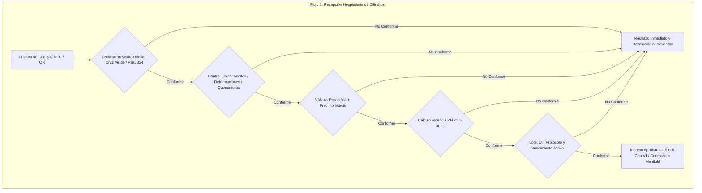
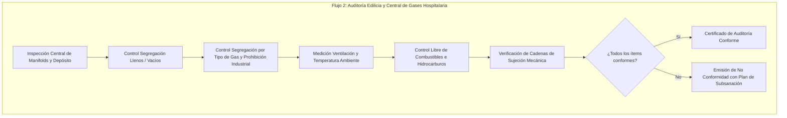
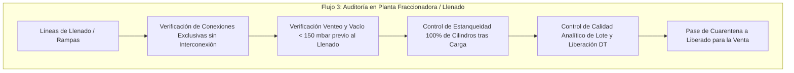

# MATRIZ TÉCNICA DE AUDITORÍA, CONTROL Y VALIDACIÓN DE GASES MEDICINALES
## Basada en la Resolución N° 1130/2000 — Ministerio de Salud de la República Argentina
### Aplicación en Inspecciones Hospitalarias, Centrales de Gases Medicinales y Plantas de Fabricación/Fraccionamiento/Distribución

---

## 1. INTRODUCCIÓN Y MARCO CONCEPTUAL DE AUDITORÍA CLÍNICA

La **Resolución 1130/2000 del Ministerio de Salud** (con la intervención de la **ANMAT**, el **INAME** y la **Dirección de Tecnología Médica**) establece el marco regulatorio integral para la fabricación, fraccionamiento, importación, control de calidad, almacenamiento, comercialización y trazabilidad de los **gases medicinales** en la República Argentina. 

Al catalogar al gas medicinal como un **medicamento** que entra en contacto directo con el organismo humano (frecuentemente en soporte vital, anestesia, reanimación y terapia intensiva), las exigencias de aseguramiento de la calidad y de seguridad física, química y operativa son de carácter crítico.

### Criterio de Clasificación de Criticidad STPA (System-Theoretic Process Analysis)
Para la ingeniería clínica, bioingeniería y control de calidad farmacéutico, la criticidad de los desvíos normativos se categoriza según el impacto en la seguridad del paciente, del operador y de la infraestructura hospitalaria:

* **Nivel 1 (Crítica / Catastrófica / Fatal):** 
  Condiciones que provocan o pueden provocar la muerte inmediata, asfixia/hipoxia aguda, toxicidad severa o explosión/incendio violento. Incluye: contaminación con hidrocarburos/grasas en presencia de comburentes ($O_2, N_2O$), confusión o interconexión física entre gases incompatibles (ej. administración de gas inerte o industrial a un paciente), falla de mezcla con concentración hipóxica, ausencia de venteo y vacío previo que deje residuos tóxicos, o cilindro en uso hospitalario sin gas medicinal aprobado. **Acción de la App:** Bloqueo operativo inmediato (*Hard Stop*), segregación obligatoria y notificación de alerta roja.
* **Nivel 2 (Grave / Mayor / Regulatoria Crítica):** 
  Condiciones que comprometen las barreras de contención, la integridad del recipiente a alta presión, la estabilidad fisicoquímica o la trazabilidad legal del lote. Incluye: cilindro con prueba hidráulica (PH) vencida, ausencia de precinto de inviolabilidad, fuga detectable en válvula, rotulado sin número de lote o sin certificado de ANMAT, incumplimiento de segregación de cuarentena o almacenamiento sin ventilación reglamentaria. **Acción de la App:** Rechazo del lote/activo, pase a cuarentena e impedimento de despacho/conexión hasta subsanación formal.
* **Nivel 3 (Menor / Leve / Administrativa):** 
  Discrepancias formales, documentales o de acondicionamiento cosmético que no degradan de manera directa e inminente la pureza del gas ni la seguridad estructural del envase. Incluye: pintura exterior descascarada sin corrosión profunda, deficiencias menores en la demarcación de piso, archivo documental desordenado pero disponible, omisión de datos de contacto secundarios en el rótulo. **Acción de la App:** Observación con plan de acción correctiva a plazo fijo sin bloqueo de uso si la integridad está certificada.

---

## 2. MATRIZ EXHAUSTIVA DE AUDITORÍA E INSPECCIÓN TÉCNICA

| id | clausula_normativa | componente_activo | parametro_a_verificar | tipo_dato_interfaz | rango_o_criterio_aceptacion | criticidad_stpa (Nivel 1/2/3) |
|---|---|---|---|---|---|---|
| **RES1130-ID-001** | Art. 11 inc. 2; Doc. I Pto. 16 y 28 | Cilindro / Recipiente Criogénico | Código de color reglamentario de cuerpo y ojiva (según Res. 324/77 y normas aplicables) | Enum_SingleSelect + Photo | Color exacto según gas: Oxígeno (Blanco), Óxido Nitroso (Azul), Aire Medicinal (Blanco con franjas negras / cuerpo negro ojiva blanca según norma), Dióxido de Carbono (Gris), Nitrógeno (Negro), Helio (Marrón). Sin repintadas no autorizadas ni colores ambiguos. | Nivel 1 |
| **RES1130-ID-002** | Art. 12 inc. 1 primer punto | Rótulo del envase | Presencia y visualización de la Cruz Griega de color verde | Boolean + Photo | Presente, indeleble, proporciones de cruz griega equilátera en color verde visible en el cuerpo/ojiva del envase. | Nivel 2 |
| **RES1130-ID-003** | Art. 11 inc. 1; Doc. I Pto. 16 | Cilindro / Recipiente | Estado general de la pintura exterior y acabado superficial | Enum_SingleSelect [Óptimo, Aceptable, Deteriorada/Oxidada] | Pintura íntegra, uniforme, limpia, sin descascaramiento que impida la identificación del gas o cubra marcas troqueladas de seguridad. | Nivel 3 |
| **RES1130-ID-004** | Doc. I Pto. 16 primer guion | Ojiva y cuerpo del cilindro / Válvula | Ausencia total de aceites, grasas, lubricantes o restos de hidrocarburos | Boolean + Photo (Requerida en fallo) | Cero tolerancia (100% libre de materias grasas, aceites o hidrocarburos en cuerpo, tulipa, rosca y válvula). Riesgo de combustión espontánea / explosión violenta en contacto con comburentes. | Nivel 1 |
| **RES1130-ID-005** | Doc. I Pto. 16 primer guion | Cuerpo metálico del cilindro | Integridad física exterior: ausencia de deformaciones mecánicas, abolladuras, hendiduras o socavados | Boolean + Photo | Ausencia total de deformaciones, abolladuras, aplastamientos, marcas de impacto o estrías que comprometan el espesor de pared. | Nivel 1 |
| **RES1130-ID-006** | Doc. I Pto. 16 primer guion | Cuerpo metálico y ojiva | Ausencia de quemaduras por arco eléctrico, soplete o exposición a fuego directo | Boolean + Photo | Superficie metálica sin alteraciones térmicas, cráteres de soldadura, salpicaduras de arco o evidencia de destemple por llama. | Nivel 1 |
| **RES1130-ID-007** | Doc. I Pto. 16 primer guion | Base y cuerpo del cilindro | Estabilidad vertical y ausencia de corrosión picante (pitting) en la base | Boolean | Base plana, verticalidad estable sin oscilación; ausencia de corrosión bajo faldón que comprometa el apoyo o espesor. | Nivel 2 |
| **RES1130-ID-008** | Doc. I Pto. 15 | Cilindros nuevos o reensayados | Inspección visual interna del interior del cilindro (previo a primer llenado o post-PH) | Boolean + Date + User_Signature | Interior completamente limpio, seco, desprovisto de escamas de óxido, agua, partículas extrañas, restos de aceite o contaminantes. | Nivel 1 |
| **RES1130-ID-009** | Doc. I Pto. 16 segundo guion | Válvula del cilindro / Acople criogénico | Correspondencia unívoca de la conexión de salida según el tipo de gas medicinal (Roscas IRAM 2539 / CGA correspondientes) | Enum_SingleSelect + Scan_NFC_Barcode | Conexión específica para el gas declarado. Prohibido el uso de adaptadores universales o conexiones modificadas. Imposibilidad de conectar un gas erróneo. | Nivel 1 |
| **RES1130-ID-010** | Doc. I Pto. 7 | Salida de válvula | Dispositivo de inviolabilidad en la conexión de salida (precinto termocontraíble / tapón precintado) | Boolean + Photo | Precinto intacto de fábrica/fraccionador que certifique que el envase no ha sido manipulado ni contaminado desde su liberación. | Nivel 2 |
| **RES1130-ID-011** | Doc. I Pto. 20 | Válvula, vástago, rosca y fusible de seguridad | Ensayo de estanqueidad y detección de fugas (solución aprobada o detector electrónico) | Boolean + Enum [Aprobado sin fugas, Fuga detectada] | Ausencia total de fugas (burbujeo nulo) a presión nominal de trabajo en el asiento de la válvula, vástago, rosca de inserción y disco de ruptura/fusible. | Nivel 1 |
| **RES1130-ID-012** | Doc. I Pto. 16 primer guion | Válvula | Estado mecánico de la válvula, volante y rosca de acople | Enum_SingleSelect [Operable sin esfuerzo, Engranada, Deformada, Roscas barridas] | Giro suave, volante intacto no rajado, rosca sin deformaciones, filetes íntegros sin rebabas ni suciedad. | Nivel 2 |
| **RES1130-ID-013** | Doc. I Pto. 16 tercer guion | Ojiva del cilindro / Recipiente | Verificación de troquelado de Prueba Hidráulica (PH) y pruebas periódicas | Date_Input + OCR_Image + Text_Inspector_Stamp | Fecha estampada legible; sello de taller o centro de revisión habilitado por autoridad competente (IRAM / Secretaría de Energía / ENARGAS). | Nivel 1 |
| **RES1130-ID-014** | Doc. I Pto. 16 tercer guion | Cilindro / Recipiente | Vigencia de la Prueba Hidráulica Periódica | Calculated_Date_Validation | Antigüedad de la última prueba menor a 5 años respecto a la fecha de inspección/llenado. Si la fecha está vencida, el envase debe ser rechazado inmediatamente. | Nivel 1 |
| **RES1130-ID-015** | Doc. I Pto. 16 tercer guion | Ojiva del cilindro | Peso propio (Tara), Presión de trabajo (TP) y Presión de prueba (PP) troqueladas | Number [kg / bar] + OCR_Image | Valores troquelados legibles y concordantes con la ficha técnica del fabricante del cilindro y certificado del lote. | Nivel 2 |
| **RES1130-ID-016** | Art. 12 inc. 1 segundo punto | Rótulo / Etiqueta | Nombre genérico del gas medicinal contenido | Text_Exact_Match | Denominación genérica inequívoca según Farmacopea (ej. "Oxígeno Medicinal", "Óxido Nitroso Medicinal", "Aire Sintético Medicinal", etc.). | Nivel 1 |
| **RES1130-ID-017** | Art. 12 inc. 1 tercer punto | Rótulo / Etiqueta | Número de Certificado de Registro de Producto otorgado por ANMAT | Text_Input + System_Regex_Validation | Formato de disposición o certificado de ANMAT válido y activo en el padrón oficial (Vigencia máx. 5 años s/ Art. 10). | Nivel 2 |
| **RES1130-ID-018** | Art. 12 inc. 1 cuarto punto | Rótulo / Etiqueta | Composición cualicuantitativa y tenor de pureza declarada | Text_Input + Percentage_Number | Declaración explícita (ej. "Oxígeno $\ge$ 99,5% v/v", "CO2 $\le$ 300 ppm", "CO $\le$ 5 ppm", "H2O $\le$ 67 ppm"). Acorde a especificación de Farmacopea. | Nivel 1 |
| **RES1130-ID-019** | Art. 12 inc. 1 quinto punto | Rótulo / Etiqueta | Especificaciones técnicas de contenido (volumen normal $m^3$ o masa kg) | Number_Input [m3 / kg / L] | Coincidencia entre el contenido físico cargado, la capacidad geométrica del envase y lo especificado en la etiqueta. | Nivel 2 |
| **RES1130-ID-020** | Art. 12 inc. 1 quinto punto | Rótulo / Etiqueta | Presión nominal de envasado a $15^\circ C / 20^\circ C$ | Number_Input [bar / psi / kPa] | Declaración explícita de la presión de llenado normalizada (ej. 150 bar, 200 bar) correspondiente a la prueba de carga. | Nivel 2 |
| **RES1130-ID-021** | Art. 12 inc. 1 sexto punto | Rótulo / Etiqueta | Identificación de la Empresa Titular (Razón social y domicilio completo) | Text_Input | Razón social, dirección de sede legal y planta, teléfonos de emergencia del titular autorizado por ANMAT. | Nivel 2 |
| **RES1130-ID-022** | Art. 12 inc. 1 sexto punto | Rótulo / Etiqueta | Identificación de la Empresa Fabricante/Fraccionadora (si difiere de la titular) | Text_Input | Si es elaborador contratado: Razón social, dirección y N° de Disposición de Habilitación de planta por ANMAT. | Nivel 2 |
| **RES1130-ID-023** | Art. 12 inc. 1 séptimo punto | Rótulo / Etiqueta adicional firme | Número de lote de producción/envasado | Text_Input + Barcode_Scan | Código alfanumérico único e indeleble adherido firmemente al cilindro o recipiente criogénico; trazable al ciclo de llenado. | Nivel 1 |
| **RES1130-ID-024** | Art. 12 inc. 1 octavo punto | Rótulo / Etiqueta | Nombre y Apellido del Director Técnico y Número de Matrícula Profesional | Text_Input | Profesional farmacéutico o técnico habilitado con matrícula provincial o nacional vigente ante el Ministerio/ANMAT. | Nivel 2 |
| **RES1130-ID-025** | Art. 12 inc. 1 noveno punto | Rótulo / Etiqueta | Fecha de llenado del lote | Date_Input | Fecha real de finalización del ciclo de llenado y liberación. | Nivel 2 |
| **RES1130-ID-026** | Art. 12 inc. 1 noveno punto | Rótulo / Etiqueta | Fecha de vencimiento / vida útil (cuando corresponda) | Date_Input | Fecha posterior a la fecha actual de auditoría. Si está vencido: bloqueo de uso clínico inmediato. | Nivel 1 |
| **RES1130-ID-027** | Art. 12 inc. 1 décimo punto | Rótulo / Etiqueta | Condiciones especiales de almacenamiento y conservación | Text_Input | Leyendas claras de preservación (ej. "Mantener por debajo de $50^\circ C$", "Proteger del sol", "Almacenar en lugar ventilado"). | Nivel 2 |
| **RES1130-ID-028** | Art. 12 inc. 1 undécimo punto | Rótulo / Etiqueta | Instructivo y precauciones de manipulación correcta y segura | Boolean_Checked | Presencia de advertencias de seguridad operacional (no engrasar, sujetar contra caídas, abrir lentamente, ventilar). | Nivel 2 |
| **RES1130-ID-029** | Art. 12 inc. 1 duodécimo punto | Rótulo / Etiqueta | Leyenda médica obligatoria expresa | Text_Exact_Match | Verificación textual exacta: **"El empleo y dosificación de este gas debe ser prescrito por un médico"**. No se admiten abreviaturas ni omisiones. | Nivel 2 |
| **RES1130-ID-030** | Doc. I Pto. b, primer guion | Depósito / Central de gases | Segregación física y señalización de zonas exclusivas para los diferentes tipos de gases | Boolean + Photo | Áreas claramente delimitadas, identificadas con cartelería para cada gas (Oxígeno, Aire, N2O, etc.), evitando cualquier mezcla. | Nivel 1 |
| **RES1130-ID-031** | Doc. I Pto. b, segundo guion | Depósito / Central de gases | Independencia y separación física absoluta entre gases medicinales y gases no medicinales (industriales) | Boolean + Photo | Sectores o recintos físicamente separados e independientes. Prohibición estricta de convivencia o cruce en la misma área. | Nivel 1 |
| **RES1130-ID-032** | Doc. I Pto. b, tercer guion | Depósito / Central de gases | Separación e identificación inequívoca entre recipientes llenos y vacíos | Boolean + Photo | Bahías o boxes separados físicamente con cartelería clara: "CILINDROS LLENOS" y "CILINDROS VACÍOS" claramente diferenciados. | Nivel 1 |
| **RES1130-ID-033** | Doc. I Pto. b, cuarto guion | Depósito / Parque de envases | Prohibición de cilindros industriales en el circuito medicinal | Boolean | Ningún cilindro con identificación, pintura o marcas industriales debe estar en proceso, almacenamiento o uso medicinal. | Nivel 1 |
| **RES1130-ID-034** | Doc. I Pto. b, quinto guion | Depósito / Área de producción | Distinción física/operativa de los 4 estados: Vacíos, Llenos, En Cuarentena y Liberados | Enum_MultiSelect_Status + Photo | Existencia de demarcación física en piso, cartelería o jaulas independientes para cada uno de los 4 estados sin ambigüedad. | Nivel 2 |
| **RES1130-ID-035** | Doc. I Pto. 30 | Depósito / Central de gases | Protección contra intemperie y temperaturas extremas | Boolean + Temperature_Input [$^\circ C$] | Techo o tinglado protector contra rayos solares directos y lluvia; temperatura ambiente controlada (rango $0^\circ C$ a $45^\circ C$, sin exposición $>50^\circ C$). | Nivel 2 |
| **RES1130-ID-036** | Doc. I Pto. 30 | Depósito / Central de gases | Ventilación del recinto (natural cruzada o extracción forzada reglamentaria) | Enum_SingleSelect [Excelente, Adecuada, Insuficiente] | Ventilación permanente que impida la acumulación de gases asfixiantes o sobreoxigenación de la atmósfera ($O_2 > 23,5\%$ o acumulación de N2/N2O/CO2). | Nivel 1 |
| **RES1130-ID-037** | Doc. I Pto. 30 | Depósito / Central de gases | Ausencia absoluta de materiales combustibles, inflamables o fuentes de ignición | Boolean + Photo | Perímetro de seguridad libre de cartones, maderas, solventes, pinturas, trapos con aceite, hidrocarburos o llamas abiertas. | Nivel 1 |
| **RES1130-ID-038** | Doc. I Pto. a y Pto. 30 | Depósito / Central de gases | Estado de orden, higiene y limpieza general del sector | Enum_SingleSelect [Conforme, No Conforme] | Pisos limpios, despejados de obstáculos, sin charcos de agua o aceite, vías de evacuación libres. | Nivel 2 |
| **RES1130-ID-039** | Doc. I Pto. 31 | Depósito / Central de gases | Sistema de rotación de existencias (FIFO / PEPS) | Enum_SingleSelect [Auditado Conforme, Deficiente, Inexistente] | Gestión que garantice que los cilindros con fecha de llenado más antigua se utilicen/despachen primero, evitando el envejecimiento en stock. | Nivel 3 |
| **RES1130-ID-040** | Buenas prácticas de ingeniería clínica | Depósito / Central de gases | Sujeción mecánica y prevención de caídas de cilindros | Boolean + Photo | Cadenas de retención, barandas o jaulas de sujeción fijas y firmes que impidan el vuelco accidental de cilindros en batería o individuales. | Nivel 1 |
| **RES1130-ID-041** | Doc. I Pto. 3.a | Rampas / Líneas de llenado y manifolds | Inexistencia absoluta de interconexiones físicas entre conductos de gases distintos | Boolean + Photo | Tuberías y colectores totalmente segregados. Cero posibilidad de flujo cruzado entre líneas de gases diferentes. | Nivel 1 |
| **RES1130-ID-042** | Doc. I Pto. 3.b y Pto. 13 | Rampas de llenado / Colectores | Conexiones de llenado mecánicamente exclusivas e incompatibles para el gas asignado | Boolean | Conectores pigtail y acoples con rosca indexada que impidan físicamente montar un cilindro de gas distinto en la rampa. | Nivel 1 |
| **RES1130-ID-043** | Doc. I Pto. 3.c | Planta / Central hospitalaria | Procedimiento escrito de concordancia entre gases y válvulas disponible en planta | Boolean + Document_Link | Manual o POE escrito y plastificado/visible en la rampa, describiendo las especificaciones de conexión por gas. | Nivel 2 |
| **RES1130-ID-044** | Doc. I Pto. 4 | Línea compartida excepcional | Presencia y operatividad de Válvula Antirretorno (check valve) en línea no medicinal | Boolean + Test_Result | Válvula antirretorno verificada operativamente, impidiendo cualquier retroceso de gas no medicinal al sistema medicinal. | Nivel 1 |
| **RES1130-ID-045** | Doc. I Pto. 6 | Líneas de abastecimiento / Tuberías | Pruebas periódicas de estanqueidad en cañerías para evitar contaminación por fisuras | Date_Input + Pressure_Drop_Test [$\Delta P$ bar] | Registro de prueba hidrostática o neumática periódica de estanqueidad sin caída de presión en el tiempo establecido por POE. | Nivel 1 |
| **RES1130-ID-046** | Doc. I Pto. 14 | Rampas y tuberías | Procedimientos escritos de limpieza y purga de líneas y equipos de llenado | Document_Review [Aprobado, Observado] | POE validado para limpieza y purga química/gaseosa previo al uso de instalaciones nuevas o intervenidas. | Nivel 2 |
| **RES1130-ID-047** | Doc. I Pto. 14 | Rampas y tuberías | Control analítico de ausencia de agentes de limpieza o contaminantes antes de uso | Boolean + Analytical_Report | Determinación instrumental certificando cero residuos de solventes, detergentes o humedad en la rampa antes de habilitar el flujo. | Nivel 1 |
| **RES1130-ID-048** | Doc. I Pto. 17 primer guion | Proceso de llenado | Procedimiento y registro de eliminación de gas residual (venteo a la atmósfera) | Boolean + POE_Check | Verificación de que cada cilindro retornado es despresurizado y venteado de forma segura antes de su acondicionamiento. | Nivel 1 |
| **RES1130-ID-049** | Doc. I Pto. 17 segundo guion | Proceso de llenado | Vaciado / Evacuación del cilindro a presión absoluta menor a 150 mbar ($\ge 25''\ Hg$ de vacío) | Number_Input [mbar / inHg] | Manovacuómetro calibrado registrando presión absoluta $< 150\text{ mbar}$ (vacío superior a $25\text{ pulgadas de mercurio}$ / $635\text{ mmHg}$). | Nivel 1 |
| **RES1130-ID-050** | Doc. I Pto. 18 | Mezclas de gases | Garantía de homogeneidad y mezclado homogéneo en cada cilindro | Boolean + Analytical_Validation | Protocolo de agitación, ciclado térmico o mezclado dinámico validado que asegure concentración uniforme en toda la columna del gas. | Nivel 1 |
| **RES1130-ID-051** | Doc. I Pto. 19 | Proceso de llenado | Verificación de presión nominal de llenado corregida por temperatura ambiente | Number_Input [bar] | Presión dentro de la tolerancia de diseño ($\pm 2\%$ de la presión de servicio ajustada por tabla de compresibilidad a la temperatura de carga). | Nivel 2 |
| **RES1130-ID-052** | Doc. I Pto. 21 | Control de calidad (Monogas rampa) | Análisis de pureza e impurezas de al menos 1 cilindro por ciclo ininterrumpido | Analytical_Batch_Report [Pureza %, Impurezas ppm] | Identidad confirmada; tenor de impurezas ($CO, CO_2, H_2O$, etc.) dentro de límites de Farmacopea Argentina. | Nivel 1 |
| **RES1130-ID-053** | Doc. I Pto. 22 | Control de calidad (Monogas unitario) | Análisis de pureza e impurezas de al menos 1 cilindro por sesión de trabajo unitario | Analytical_Batch_Report | Identidad y pureza aprobada por el laboratorio para cada corrida de llenado individual. | Nivel 1 |
| **RES1130-ID-054** | Doc. I Pto. 23 | Mezclas binarias | Identificación y cuantificación de 1 gas + impurezas en el 100% de los cilindros | Analytical_Report_100_Percent | Verificación cilindro por cilindro del componente activo crítico y análisis de impurezas en todos los envases del lote. | Nivel 1 |
| **RES1130-ID-055** | Doc. I Pto. 23 | Mezclas binarias | Identificación del segundo componente en al menos 1 cilindro por ciclo de llenado | Analytical_Report | Identificación positiva del componente secundario en la muestra de control del ciclo. | Nivel 1 |
| **RES1130-ID-056** | Doc. I Pto. 24 | Mezclas ternarias | Identificación y cuantificación de 2 gases + impurezas en el 100% de los cilindros | Analytical_Report_100_Percent | Ensayo analítico cuantitativo individual en cada uno de los cilindros llenados para 2 de los gases de la mezcla. | Nivel 1 |
| **RES1130-ID-057** | Doc. I Pto. 24 | Mezclas ternarias | Identificación del tercer componente en al menos 1 cilindro por ciclo de llenado | Analytical_Report | Identificación confirmada del tercer componente en la muestra representativa del ciclo. | Nivel 1 |
| **RES1130-ID-058** | Doc. I Pto. 25 | Mezcla continua en tubería (ej. O2/N2O) | Análisis continuo en línea de la mezcla durante todo el proceso de llenado | Continuous_Telemetry_Log [Min/Max/Avg %] | Monitoreo instrumental ininterrumpido con analizador en línea con enclavamiento automático por desvío de concentración. | Nivel 1 |
| **RES1130-ID-059** | Doc. I Pto. 26 | Recipientes criogénicos licuados para usuarios | Identificación, cuantificación y tenor de impurezas en el 100% de los recipientes | Analytical_Report_100_Percent | Cada termo criogénico entregado a hospital debe contar con su protocolo analítico individual de pureza e impurezas aprobado. | Nivel 1 |
| **RES1130-ID-060** | Doc. I Pto. 11 | Transferencia de fluidos criogénicos | Procedimiento escrito para evitar contaminación en operaciones de trasvase | Boolean + Procedure_Check | Cumplimiento del protocolo de purga de manguera criogénica, conexiones limpias y venteo previo a la transferencia. | Nivel 2 |
| **RES1130-ID-061** | Doc. I Pto. 12 | Descarga a tanques criogénicos de almacenamiento | Ejecución y conformidad analítica de descarga (al menos 1 de las 3 opciones normativas) | Enum_SingleSelect [Muestra previa descarga, Muestra tanque post-descarga, Primer cilindro tras purga] + Protocol_ID | Protocolo analítico adjunto que certifique que el gas descargado cumple especificaciones antes de liberar el tanque para producción o suministro. | Nivel 1 |
| **RES1130-ID-062** | Art. 12 inc. 2 | Transporte en cisterna a granel | Certificado de transporte con datos de rotulado y protocolo de análisis de lote | Document_Attach_PDF + Photo_Shipping_Doc | Remito/Certificado que acompaña físicamente al camión cisterna con análisis firmado y fechado por el responsable técnico emisor. | Nivel 1 |
| **RES1130-ID-063** | Art. 12 inc. 3 | Archivo documental de cisternas | Archivo físico o digital del certificado de cisterna por el destinatario (hospital/planta) | Date_Range_Check | Archivo obligatorio durante al menos 1 año post-vencimiento, o 3 años posteriores a la fecha de llenado si no tiene vencimiento. | Nivel 2 |
| **RES1130-ID-064** | Doc. I Pto. 9 | Cisternas de transporte | Purga analítica obligatoria en cisterna cuando cambia el tipo de gas transportado | Analytical_Report [Límites cumplidos] | Purga con el nuevo gas hasta que los ensayos de laboratorio certifiquen que los residuos del gas anterior están por debajo de límites. | Nivel 1 |
| **RES1130-ID-065** | Doc. I Pto. 29 | Lotes producidos / recibidos | Cuarentena obligatoria post-llenado hasta liberación formal por el Director Técnico | Boolean + Status [Bloqueado en Cuarentena / Liberado] | Ningún cilindro puede distribuirse, montarse o conectarse sin la firma y liberación formal del lote por el Director Técnico. | Nivel 1 |
| **RES1130-ID-066** | Art. 2 y Art. 4 inc. 2; Doc. I Personal | Gestión técnica de planta / central | Presencia de Director Técnico calificado y matriculado responsable de la liberación | User_Signature + Professional_License_Number | Firma digital/ológrafa del DT matriculado en el registro de liberación de cada lote. | Nivel 1 |
| **RES1130-ID-067** | Art. 4 inc. 1 | Empresa Titular / Fabricante | Habilitación sanitaria vigente emitida por ANMAT (Ley 16.463 y Dec. 150/92) | Text_Input + Certificate_Expiration_Date | Habilitación de planta y rubro "Gases Medicinales" vigente emitida por autoridad sanitaria. | Nivel 1 |
| **RES1130-ID-068** | Art. 4 inc. 3 | Infraestructura de planta titular | Disponibilidad de depósito adecuado y laboratorio de control de calidad propio | Boolean_Audit | Instalaciones de laboratorio equipadas con instrumental analítico calibrado (cromatógrafo, analizador paramagnético, higrómetro, etc.). | Nivel 2 |
| **RES1130-ID-069** | Art. 7 | Modificación de estructuras | Autorización previa de ANMAT ante reformas en locales, instalaciones o traslados | Boolean + Exp_Ref | Toda modificación de layout, rampa o líneas cuenta con aprobación sanitaria formal previa. | Nivel 2 |
| **RES1130-ID-070** | Art. 14 inc. 1, 2 y 3 | Fabricación por contrato a terceros | Contrato escrito vigente y registro actualizado de trabajos y lotes liberados | Document_Link + Traceability_Log | Contrato bilateral firmado por representantes legales y directores técnicos; libro o sistema de registro de lotes encomendados y liberados. | Nivel 2 |
| **RES1130-ID-071** | Art. 15 inc. 1, 2 y 3 | Tercerización de ensayos analíticos | Autorización previa de ANMAT y contrato formal con laboratorio habilitado | Document_Link | Habilitación del laboratorio externo por ANMAT y contrato específico de control de calidad firmado por ambos directores técnicos. | Nivel 2 |
| **RES1130-ID-072** | Doc. I Personal | Capacitación del personal | Registro de inducción y capacitación en BPFyC de gases medicinales y riesgos críticos | Training_Record + Date | Constancia de entrenamiento del personal operativo en manejo seguro de gases medicinales a alta presión y prevención de contaminación. | Nivel 3 |
| **RES1130-ID-073** | Doc. I Pto. 5 | Mantenimiento de instalaciones | Registros de mantenimiento preventivo y calibración de equipos sin riesgo para el gas | Maintenance_Log + Calibration_Certificates | Calibración vigente de manómetros, balanzas, transmisores de presión, analizadores de gas y detectores de fuga. | Nivel 2 |
| **RES1130-ID-074** | Art. 8 inc. 2 | Protocolo de Control de Calidad | Concordancia con especificaciones de Farmacopea Nacional Argentina | Analytical_Comparison_Matrix | Parámetros del protocolo contrastados automáticamente contra la monografía oficial de Farmacopea para el gas medicinal en cuestión. | Nivel 1 |

---

## 3. WORKFLOWS Y LÓGICA DE APLICACIÓN EN TERRENO

Para que la aplicación móvil y web sea un instrumento efectivo de ingeniería clínica y auditoría, el sistema debe estructurarse en **tres flujos operativos específicos**:

---

## 4. RECOMENDACIONES PARA EL MODELO DE DATOS DE LA APLICACIÓN

A partir del desglose exhaustivo de la Resolución 1130/2000, se definen las entidades, relaciones y campos obligatorios que la base de datos (PostgreSQL / SQLite móvil) debe implementar para garantizar la trazabilidad completa requerida por la ANMAT:

### 4.1. Entidad: `empresa_titular` / `empresa_fabricante`
* `id` (UUID, Primary Key)
* `cuit` (VARCHAR(11), Unique, Not Null)
* `razon_social` (VARCHAR(200), Not Null)
* `tipo_empresa` (ENUM: 'TITULAR', 'FABRICANTE_CONTRATADO', 'DISTRIBUIDOR', 'HOSPITAL')
* `numero_disposicion_anmat` (VARCHAR(50), Not Null) — *Derivado de Art. 4 y Formulario A/B*
* `fecha_habilitacion_anmat` (DATE, Not Null)
* `domicilio_legal` (TEXT, Not Null)
* `domicilio_planta` (TEXT, Not Null)
* `telefono_guardia` (VARCHAR(50), Not Null)
* `activo` (BOOLEAN, Default True)

### 4.2. Entidad: `director_tecnico`
* `id` (UUID, Primary Key)
* `nombre_completo` (VARCHAR(150), Not Null)
* `tipo_documento` (VARCHAR(10), Default 'DNI')
* `numero_documento` (VARCHAR(20), Not Null)
* `titulo_profesional` (VARCHAR(100), Not Null) — *Ej. Farmacéutico, Ingeniero Químico*
* `numero_matricula` (VARCHAR(50), Not Null) — *Derivado de Art. 12 inc. 1 y Formulario A*
* `colegio_o_ministerio_emisor` (VARCHAR(100), Not Null)
* `disposicion_individual_anmat` (VARCHAR(50))
* `empresa_id` (UUID, Foreign Key -> `empresa_titular.id`)

### 4.3. Entidad: `activo_cilindro_criogenico`
* `id` (UUID, Primary Key)
* `codigo_identificador_rfid_qr` (VARCHAR(100), Unique, Not Null)
* `numero_serie_grabado` (VARCHAR(50), Not Null) — *Número troquelado por fabricante del cilindro*
* `tipo_recipiente` (ENUM: 'CILINDRO_ALTA_PRESION', 'BLOQUE_BATERIA', 'TERMO_CRIOGENICO', 'CISTERNA_MOVIL')
* `gas_autorizado_id` (UUID, Foreign Key -> `catalogo_gases.id`) — *Asignación fija para evitar cruce industrial/medicinal*
* `es_medicinal` (BOOLEAN, Default True, Not Null) — *Pto. b y Pto. 16: Prohibición de uso industrial*
* `capacidad_geometrica_litros` (NUMERIC(8,2), Not Null)
* `presion_trabajo_nominal_bar` (NUMERIC(6,2), Not Null)
* `presion_prueba_hidraulica_bar` (NUMERIC(6,2), Not Null)
* `tara_kg` (NUMERIC(8,2), Not Null)
* `fecha_ultima_prueba_hidraulica` (DATE, Not Null) — *Derivado de Doc. I Pto. 16*
* `fecha_vencimiento_ph` (DATE, Generated ALWAYS AS (`fecha_ultima_prueba_hidraulica` + INTERVAL '5 years') STORED)
* `estampa_taller_ph` (VARCHAR(50), Not Null)
* `tipo_valvula_conexion` (VARCHAR(50), Not Null) — *Ej. IRAM 2539 tipo 1, CGA 540*
* `color_cuerpo` (VARCHAR(30), Not Null)
* `color_ojiva` (VARCHAR(30), Not Null)
* `estado_operativo` (ENUM: 'EN_SERVICIO', 'EN_CUARENTENA', 'EN_REVISION_PH', 'BAJA_DEFINITIVA')

### 4.4. Entidad: `lote_produccion`
* `id` (UUID, Primary Key)
* `numero_lote` (VARCHAR(50), Unique, Not Null) — *Derivado de Art. 2 y Art. 12 inc. 1*
* `producto_gas_id` (UUID, Foreign Key -> `catalogo_gases.id`)
* `empresa_titular_id` (UUID, Foreign Key -> `empresa_titular.id`)
* `empresa_fabricante_id` (UUID, Foreign Key -> `empresa_fabricante.id`)
* `director_tecnico_liberador_id` (UUID, Foreign Key -> `director_tecnico.id`)
* `fecha_llenado` (TIMESTAMP WITH TIME ZONE, Not Null) — *Derivado de Art. 12 inc. 1*
* `fecha_vencimiento` (DATE) — *Si aplica s/ monografía de estabilidad*
* `tipo_proceso_llenado` (ENUM: 'RAMPA_CONTINUA', 'INDIVIDUAL', 'MEZCLA_LINEA', 'CRIOGENICO')
* `presion_llenado_registrada_bar` (NUMERIC(6,2), Not Null)
* `temperatura_llenado_celsius` (NUMERIC(4,2), Not Null)
* `vacio_previo_alcanzado_mbar` (NUMERIC(6,2), Not Null) — *Validación obligatoria < 150 mbar*
* `pureza_porcentaje_ensayada` (NUMERIC(5,2), Not Null)
* `tenor_impurezas_json` (JSONB, Not Null) — *Ej: {"CO_ppm": 1.2, "CO2_ppm": 110, "H2O_ppm": 22}*
* `estado_liberacion` (ENUM: 'CUARENTENA', 'LIBERADO_DT', 'RECHAZADO') — *Doc. I Pto. 29*
* `fecha_liberacion_dt` (TIMESTAMP WITH TIME ZONE)
* `hash_firma_digital_dt` (TEXT)
* `url_protocolo_analisis_pdf` (TEXT, Not Null)

### 4.5. Entidad: `auditoria_inspeccion_registro`
* `id` (UUID, Primary Key)
* `tipo_auditoria` (ENUM: 'RECEPCION_HOSPITALARIA', 'CENTRAL_MANIFOLD', 'PLANTA_LLENADO', 'CISTERNA_GRANEL')
* `establecimiento_hospital_id` (UUID, Not Null)
* `usuario_inspector_id` (UUID, Not Null)
* `fecha_hora_inspeccion` (TIMESTAMP WITH TIME ZONE, Not Null)
* `geolocalizacion_latitud` (NUMERIC(10,7))
* `geolocalizacion_longitud` (NUMERIC(10,7))
* `cilindro_id` (UUID, Foreign Key -> `activo_cilindro_criogenico.id`)
* `lote_id` (UUID, Foreign Key -> `lote_produccion.id`)
* `presion_manometrica_actual_bar` (NUMERIC(6,2))
* `estado_precinto_inviolabilidad` (BOOLEAN, Not Null)
* `cruz_griega_presente` (BOOLEAN, Not Null)
* `leyenda_medica_conforme` (BOOLEAN, Not Null)
* `libre_de_grasas_hidrocarburos` (BOOLEAN, Not Null)
* `integridad_mecanica_conforme` (BOOLEAN, Not Null)
* `ph_vigente_calculada` (BOOLEAN, Not Null)
* `resultado_inspeccion` (ENUM: 'APROBADO', 'OBSERVADO', 'RECHAZADO_BLOQUEADO')
* `nivel_criticidad_max_detectada` (ENUM: 'NINGUNA', 'NIVEL_1', 'NIVEL_2', 'NIVEL_3')
* `motivo_rechazo_codigo` (VARCHAR(50))
* `fotografias_evidencia_urls` (TEXT[])
* `firma_digital_auditor` (TEXT, Not Null)

### 4.6. Entidad: `certificado_cisterna_transporte`
* `id` (UUID, Primary Key)
* `numero_remito_certificado` (VARCHAR(50), Unique, Not Null)
* `cisterna_patente_tractor` (VARCHAR(20), Not Null)
* `cisterna_patente_tanque` (VARCHAR(20), Not Null)
* `chofer_nombre` (VARCHAR(150), Not Null)
* `chofer_licencia_cargas_peligrosas` (VARCHAR(50), Not Null)
* `gas_transportado_id` (UUID, Foreign Key -> `catalogo_gases.id`)
* `lote_origen_id` (UUID, Foreign Key -> `lote_produccion.id`)
* `empresa_emisora_id` (UUID, Foreign Key -> `empresa_titular.id`)
* `destinatario_establecimiento_id` (UUID, Not Null)
* `fecha_despacho` (TIMESTAMP WITH TIME ZONE, Not Null)
* `fecha_recepcion_descarga` (TIMESTAMP WITH TIME ZONE)
* `analisis_descarga_modalidad` (ENUM: 'PREVIA_DESCARGA', 'POST_DESCARGA_TANQUE', 'PRIMER_CILINDRO') — *Doc. I Pto. 12*
* `resultado_analisis_descarga` (ENUM: 'CONFORME', 'NO_CONFORME')
* `fecha_limite_custodia_archivo` (DATE, Not Null) — *Derivado de Art. 12 inc. 3: Mín. 3 años post-llenado o 1 año post-vencimiento*
* `url_certificado_firmado_pdf` (TEXT, Not Null)

---

## 5. REGLAS DURAS DE NEGOCIO (HARD VALIDATIONS / INTERLOCKS)

El software no debe permitir la anulación manual o el bypass de las siguientes condiciones críticas:

1. **Bloqueo por Hidrocarburos / Grasas (Nivel 1):** Si el inspector marca `libre_de_grasas_hidrocarburos = False`, el sistema bloquea inmediatamente el cilindro, genera una alarma visual roja, notifica al Jefe de Bioingeniería y prohíbe su asignación o conexión a cualquier manifold hospitalario.
2. **Bloqueo por Prueba Hidráulica Vencida (Nivel 1):** Si `CURRENT_DATE > fecha_vencimiento_ph`, el sistema inhabilita la recepción en farmacia/central y rechaza la orden de llenado en planta.
3. **Bloqueo por Violación de Cuarentena (Nivel 1):** Ningún cilindro perteneciente a un lote cuyo `estado_liberacion` sea diferente de `'LIBERADO_DT'` puede ser escaneado para despacho o consumo clínico.
4. **Validación de Vacío en Rampa (Nivel 1):** En la interfaz de planta, la orden de llenado no puede pasar a la fase de inyección de gas medicinal si el manovacuómetro no registró y transmitió un valor inferior a $150\text{ mbar}$ absolutos.
5. **Validación de Rótulo Crítico (Nivel 2):** Es mandatorio el reconocimiento óptico (OCR) o confirmación explícita de la leyenda médica: *"El empleo y dosificación de este gas debe ser prescrito por un médico"*.
6. **Alerta Temprana de PH (Preventiva):** Notificación automática a bioingeniería cuando un cilindro en stock hospitalario se encuentre a 60 días o menos del vencimiento de su prueba hidráulica quinquenal.
7. **Regla de Archivo Obligatorio (Nivel 2):** Los registros de recepción de cisternas criogénicas se bloquean contra eliminación del sistema por un período mínimo estricto de 3 años contados a partir de la fecha de llenado/descarga.
